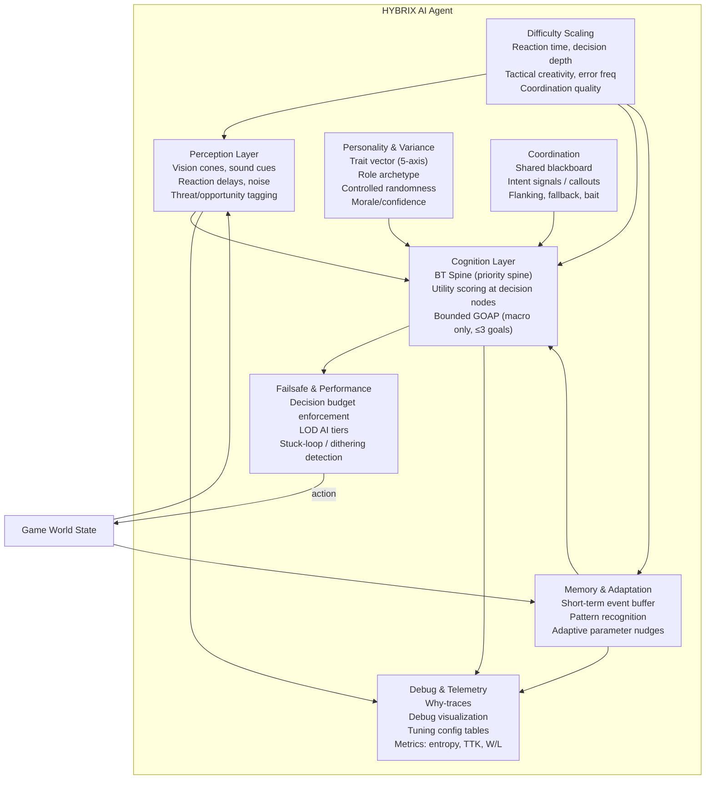

# HYBRIX AI Architecture — Shippable Game AI

> **Version:** 1.0.0  
> **Status:** Implementable  
> **Assumptions:** Real-time or turn-based; engine-agnostic; ~60 FPS target for real-time; per-bot decision budget ≤ 0.5 ms

> **Intrilex Integration Note:** When used as a card-game policy via `policy-adapter.mjs`, the agent's `choose(context)` function bypasses the spatial perception/cognition pipeline (vision cones, sound, occlusion) and instead uses `assessIntrilexBoardState()` — a domain-native cognition function that evaluates `securedPoints`, `goal`, `stack`, `hand`, and `deckCount` directly. The spatial modules (`perception.mjs`, `cognition.mjs`, `coordination.mjs`, `failsafe.mjs`) are lazily instantiated only when `tick()` is called for real-time games. This ensures the card-game path has zero spatial-domain overhead and zero architectural drift.

---

## 1. High-Level Architecture Diagram



### Layer Responsibilities

| Layer | Input | Output | Budget |
|-------|-------|--------|--------|
| Perception | Raw world state | Filtered, noisy sensor data with threat tags | 0.1 ms |
| Memory | Events, outcomes | Pattern hypotheses, adaptation nudges | 0.05 ms |
| Personality | Trait vector, archetype | Decision modifiers, variance injection | 0.02 ms |
| Cognition | Sensor data + memory + traits | Selected action + reason trace | 0.3 ms |
| Coordination | Blackboard, ally intents | Coordination directives | 0.05 ms |
| Failsafe | Candidate action + timing | Validated or fallback action | 0.03 ms |
| **Total** | | | **≤ 0.5 ms** |

---

## 2. Step-by-Step Bot Decision Flow

```
1. WORLD TICK
   │
   ├─► 2. PERCEPTION LAYER
   │   ├─ Gather raw world state (positions, health, events, map signals)
   │   ├─ Apply vision cone / range / occlusion filters
   │   ├─ Apply reaction delay (queue stimuli, release after N ms)
   │   ├─ Add perception noise (miss chance, false positives)
   │   └─ Tag threats & opportunities with probabilistic scores
   │      → Output: PerceivedWorld { entities[], threats[], opportunities[], uncertainty }
   │
   ├─► 3. MEMORY UPDATE
   │   ├─ Append recent events to short-term buffer (ring buffer, N seconds)
   │   ├─ Run pattern recognition on buffer (player habits, repeated tactics)
   │   ├─ Compute adaptive nudges (accuracy, aggression, spacing adjustments)
   │   └─ Decay old memories (exponential, configurable half-life)
   │      → Output: MemorySnapshot { patterns[], adaptiveParams, confidence }
   │
   ├─► 4. PERSONALITY APPLICATION
   │   ├─ Load trait vector (aggression, patience, fear, curiosity, loyalty)
   │   ├─ Apply archetype modifiers (rusher, defender, support, etc.)
   │   ├─ Inject controlled randomness (hesitation, overcommit, human error)
   │   └─ Update morale/confidence from recent outcomes
   │      → Output: PersonalityState { traits, modifiers, morale, varianceSeed }
   │
   ├─► 5. COORDINATION CHECK
   │   ├─ Read shared blackboard for ally intents
   │   ├─ Process incoming callouts/pings
   │   ├─ Determine coordination role (leader, follower, lone wolf)
   │   └─ Issue intent signals to blackboard
   │      → Output: CoordinationDirective { role, allies[], sharedGoal }
   │
   ├─► 6. COGNITION LAYER (BT SPINE + UTILITY)
   │   ├─ A. Traverse BT spine by priority:
   │   │   1. SURVIVAL (critical threat → evade, heal, shield)
   │   │   2. COORDINATION (follow callout, cover ally, execute flank)
   │   │   3. MACRO GOAL (bounded GOAP, ≤3 active goals, depth ≤2)
   │   │   4. TACTICAL (utility-scored combat actions)
   │   │   5. IDLE/ROAM (patrol, regroup, resource gather)
   │   │
   │   ├─ B. At each decision node, run utility scoring:
   │   │   - Score each candidate action: Σ(component_weight × component_value)
   │   │   - Apply personality modifiers to weights
   │   │   - Apply memory-based adaptive nudges
   │   │   - Apply coordination directives
   │   │   - Apply difficulty-scaled error injection
   │   │
   │   ├─ C. Select action:
   │   │   - If clear winner (margin > threshold): select directly
   │   │   - If close call (margin < threshold): weighted random among top-K
   │   │   - Apply cooldowns & hesitation delays
   │   │
   │   └─ D. Generate reason trace (why-trace):
   │      - Selected action, score, margin
   │      - Top alternatives with scores
   │      - Active BT node, personality modifiers applied
   │      - Memory patterns consulted
   │      → Output: DecisionResult { action, reasonTrace, scoreBreakdown }
   │
   ├─► 7. FAILSAFE VALIDATION
   │   ├─ Check decision budget (abort to fallback if over time)
   │   ├─ Detect stuck loops (same action N times → force variation)
   │   ├─ Detect dithering (alternating between 2 actions → commit)
   │   ├─ Detect suicidal behavior (low-utility action repeated → override)
   │   ├─ LOD check (if off-screen, use simplified action)
   │   └─ Validate action is legal & non-degenerate
   │      → Output: FinalAction { action, fallbackUsed, failsafeTriggered }
   │
   ├─► 8. EXECUTE ACTION
   │   └─ Send to game engine / simulation runtime
   │
   └─► 9. TELEMETRY & DEBUG
       ├─ Record decision trace
       ├─ Update metrics (entropy, action diversity, TTK)
       ├─ Update debug visualization overlays
       └─ Write to tuning log if failsafe triggered
```

---

## 3. Example Bot Archetypes

### 3.1 "Blaze" — The Rusher
| Trait | Value (0–1) | Effect |
|-------|-------------|--------|
| Aggression | 0.90 | Prioritizes closing distance, attacking |
| Patience | 0.15 | Low hesitation, acts fast |
| Fear | 0.10 | Rarely retreats, overcommits |
| Curiosity | 0.40 | Moderate exploration |
| Loyalty | 0.30 | Low team coordination, lone wolf |

**Behavior signature:** Closes gap aggressively, favors high-damage actions, rarely blocks or retreats. Weak against traps and bait. Fun to fight because punishable.

### 3.2 "Bastion" — The Defender
| Trait | Value (0–1) | Effect |
|-------|-------------|--------|
| Aggression | 0.25 | Low, reactive |
| Patience | 0.85 | High hesitation, waits for openings |
| Fear | 0.60 | Retreats when low health |
| Curiosity | 0.20 | Stays near objective |
| Loyalty | 0.80 | Strong team coordination |

**Behavior signature:** Holds position, punishes overextensions, covers allies. Slow to initiate. Strong against rushers, weak against ranged harassment.

### 3.3 "Whisper" — The Trickster
| Trait | Value (0–1) | Effect |
|-------|-------------|--------|
| Aggression | 0.55 | Moderate, opportunistic |
| Patience | 0.65 | Bait-and-punish style |
| Fear | 0.40 | Tactical retreats |
| Curiosity | 0.85 | High, experiments with positioning |
| Loyalty | 0.45 | Moderate, self-preserving |

**Behavior signature:** Feints, baits, uses environment. Unpredictable action selection (high variance). Punishes predictable players. Can be out-tricked by adaptive opponents.

### 3.4 "Sentinel" — The Sniper
| Trait | Value (0–1) | Effect |
|-------|-------------|--------|
| Aggression | 0.45 | Selective, high-value targets only |
| Patience | 0.90 | Extreme, waits for perfect shot |
| Fear | 0.55 | Repositions when flanked |
| Curiosity | 0.30 | Low, focuses on sightlines |
| Loyalty | 0.60 | Moderate, provides overwatch |

**Behavior signature:** Maintains distance, prioritizes high-value targets, repositions when threatened. Weak when rushed. Strong map knowledge.

### 3.5 "Ember" — The Support
| Trait | Value (0–1) | Effect |
|-------|-------------|--------|
| Aggression | 0.20 | Low, defensive |
| Patience | 0.70 | Waits for ally needs |
| Fear | 0.50 | Moderate self-preservation |
| Curiosity | 0.50 | Balanced |
| Loyalty | 0.95 | Extreme, always near allies |

**Behavior signature:** Heals, shields, buffs allies. Prioritizes keeping allies alive over personal damage. Stays behind front line. Vulnerable when isolated.

---

## 4. Engine-Agnostic Pseudocode

### 4.1 Perception Layer

```pseudo
function perceive(worldState, botId, perceptionConfig):
    raw = gatherRawState(worldState, botId)
    
    // Vision filtering
    visible = []
    for entity in raw.entities:
        if distance(bot, entity) > perceptionConfig.visionRange:
            continue
        if not inVisionCone(bot, entity, perceptionConfig.coneAngle):
            continue
        if isOccluded(bot, entity, worldState.geometry):
            // Sound cue — position is approximate
            entity.approximatePosition = addNoise(entity.position, perceptionConfig.soundNoise)
            entity.sensedVia = "sound"
        else:
            entity.sensedVia = "vision"
        
        // Perception noise — chance to miss
        if random() < perceptionConfig.missChance:
            continue
        
        visible.append(entity)
    
    // Reaction delay — queue stimuli
    for stimulus in visible:
        stimulus.releaseTime = now() + perceptionConfig.reactionDelayMs * (1 + noise())
        perceptionQueue.push(stimulus)
    
    // Release delayed stimuli
    perceived = perceptionQueue.releaseReady()
    
    // Threat & opportunity tagging
    for entity in perceived:
        entity.threatScore = computeThreat(entity, bot, perceptionConfig)
        entity.opportunityScore = computeOpportunity(entity, bot, perceptionConfig)
    
    return PerceivedWorld {
        entities: perceived,
        threats: perceived.filter(e => e.threatScore > threshold),
        opportunities: perceived.filter(e => e.opportunityScore > threshold),
        uncertainty: perceptionConfig.baseUncertainty
    }
```

### 4.2 Cognition Layer — BT Spine + Utility Scoring

```pseudo
// BT Node priorities (top = highest)
BT_SPINE = [
    { id: "SURVIVAL",    priority: 100, condition: criticalThreatPresent },
    { id: "COORDINATION", priority: 80,  condition: hasActiveDirective },
    { id: "MACRO_GOAL",  priority: 60,  condition: hasActiveGoal },
    { id: "TACTICAL",    priority: 40,  condition: enemiesInEngagementRange },
    { id: "IDLE_ROAM",   priority: 20,  condition: true }  // always-true fallback
]

function decide(perceived, memory, personality, coordination, config):
    for node in BT_SPINE:
        if not node.condition(perceived, coordination):
            continue
        
        candidates = generateCandidates(node.id, perceived, memory, coordination)
        if candidates.isEmpty:
            continue
        
        // Utility score each candidate
        scored = []
        for action in candidates:
            baseScore = scoreAction(action, perceived, memory, config)
            personalityMod = applyPersonalityModifiers(baseScore, personality)
            memoryMod = applyAdaptiveNudges(personalityMod, memory)
            coordMod = applyCoordinationDirective(memoryMod, coordination)
            difficultyMod = applyDifficultyError(coordMod, config.difficulty)
            scored.append({ action, score: difficultyMod, node: node.id })
        
        // Selection
        scored.sort(by: score descending)
        margin = scored[0].score - scored[1]?.score ?? 0
        
        if margin > config.commitThreshold:
            selected = scored[0]
        else:
            // Weighted random among top-K for close calls
            topK = scored.slice(0, min(config.topK, scored.length))
            selected = weightedRandom(topK, by: score)
        
        // Cooldowns & hesitation
        if isOnCooldown(selected.action, memory):
            continue  // try next BT node
        
        // Generate why-trace
        reasonTrace = {
            btNode: node.id,
            selected: selected.action,
            score: selected.score,
            margin: margin,
            alternatives: scored.slice(0, 5),
            personalityModifiers: personality.activeModifiers,
            memoryPatterns: memory.relevantPatterns,
            coordinationRole: coordination.role
        }
        
        return DecisionResult { action: selected.action, reasonTrace }
    
    // Ultimate fallback
    return DecisionResult { action: IDLE, reasonTrace: { btNode: "FALLBACK", reason: "no candidates" } }
```

### 4.3 Bounded GOAP (Macro Goals Only)

```pseudo
function planMacroGoals(perceived, memory, config):
    // Hard cap: max 3 active goals, planning depth ≤ 2
    goals = []
    
    // Goal candidates (pre-defined, not open-ended)
    candidates = [
        { id: "CAPTURE_OBJECTIVE", priority: evaluateObjectiveValue(perceived) },
        { id: "ELIMINATE_PRIORITY_TARGET", priority: evaluateTargetValue(perceived) },
        { id: "REGROUP_WITH_ALLIES", priority: evaluateRegroupNeed(perceived) },
        { id: "SECURE_RESOURCE", priority: evaluateResourceValue(perceived) },
        { id: "DEFEND_POSITION", priority: evaluateDefenseNeed(perceived) }
    ]
    
    candidates.sort(by: priority descending)
    
    // Select top 3 (hard cap)
    for candidate in candidates.slice(0, 3):
        // Plan at most depth 2
        plan = planSteps(candidate, perceived, maxDepth: 2, maxSteps: 4)
        if plan:
            goals.append({ ...candidate, plan })
    
    return goals
```

### 4.4 Memory & Adaptation

```pseudo
class ShortTermMemory:
    buffer = RingBuffer(capacity: config.memoryWindowSeconds * tickRate)
    
    function record(event):
        entry = {
            timestamp: now(),
            type: event.type,
            actor: event.actor,
            target: event.target,
            position: event.position,
            outcome: event.outcome
        }
        buffer.push(entry)
    
    function recognizePatterns():
        patterns = []
        
        // Player habit: repeated tactic detection
        recentActions = buffer.filter(age < 10s)
        tacticCounts = groupBy(recentActions, key: a => a.type + a.position?.quadrant)
        
        for tactic, count in tacticCounts:
            if count >= 3:
                patterns.append({
                    type: "REPEATED_TACTIC",
                    tactic: tactic,
                    confidence: min(count / 5, 1.0),
                    counterStrategy: deriveCounter(tactic)
                })
        
        // Player habit: aggression profiling
        aggressionEvents = recentActions.filter(a => a.type == "ATTACK")
        aggressionRate = aggressionEvents.length / recentActions.length
        patterns.append({
            type: "AGGRESSION_PROFILE",
            value: aggressionRate,
            confidence: min(recentActions.length / 10, 1.0)
        })
        
        return patterns
    
    function getAdaptiveNudges():
        patterns = recognizePatterns()
        nudges = { accuracy: 0, aggression: 0, spacing: 0 }
        
        for pattern in patterns:
            if pattern.type == "REPEATED_TACTIC" and pattern.confidence > 0.5:
                // Nudge toward counter-strategy
                nudges.accuracy += 0.1 * pattern.confidence
                nudges.spacing += deriveSpacingAdjustment(pattern.tactic)
            
            if pattern.type == "AGGRESSION_PROFILE":
                if pattern.value > 0.7:  // player is aggressive
                    nudges.aggression -= 0.1  // play more defensively
                elif pattern.value < 0.3:
                    nudges.aggression += 0.1  // exploit passivity
        
        // Clamp nudges to prevent runaway adaptation
        nudges.accuracy = clamp(nudges.accuracy, -0.3, 0.3)
        nudges.aggression = clamp(nudges.aggression, -0.3, 0.3)
        nudges.spacing = clamp(nudges.spacing, -0.2, 0.2)
        
        // Apply difficulty cap
        nudges = scaleByDifficulty(nudges, config.difficulty)
        
        return nudges
    
    function decay():
        // Exponential decay — older memories lose weight
        for entry in buffer:
            entry.weight *= config.decayFactor  // e.g., 0.95 per tick
    
    function reset():
        buffer.clear()
```

### 4.5 Personality & Variance

```pseudo
class PersonalitySystem:
    function createAgent(archetype, seed):
        traits = ARCHETYPES[archetype].traits
        // Add per-instance variance (±0.1) so no two bots are identical
        for key in traits:
            traits[key] = clamp(traits[key] + noise(seed, key) * 0.1, 0, 1)
        
        return PersonalityState {
            traits: traits,
            archetype: archetype,
            morale: 0.5,  // starts neutral
            varianceSeed: seed,
            activeModifiers: {}
        }
    
    function applyToScoring(score, action, personality):
        t = personality.traits
        
        // Aggression modifier: boost attack actions
        if action.type == "ATTACK":
            score *= (0.7 + t.aggression * 0.6)
        
        // Patience modifier: boost wait/defend actions
        if action.type == "WAIT" or action.type == "DEFEND":
            score *= (0.7 + t.patience * 0.6)
        
        // Fear modifier: boost retreat when low health
        if action.type == "RETREAT" and action.urgency > 0.5:
            score *= (0.6 + t.fear * 0.8)
        
        // Curiosity modifier: boost explore actions
        if action.type == "EXPLORE":
            score *= (0.5 + t.curiosity * 1.0)
        
        // Loyalty modifier: boost support/protect actions
        if action.type == "SUPPORT" or action.type == "PROTECT":
            score *= (0.5 + t.loyalty * 1.0)
        
        // Controlled randomness — "human error"
        score += noise(personality.varianceSeed, action.id) * config.humanErrorRate
        
        // Morale shift — recent wins/losses affect confidence
        score *= (0.8 + personality.morale * 0.4)
        
        return score
    
    function updateMorale(personality, recentOutcome):
        if recentOutcome == "win":
            personality.morale = clamp(personality.morale + 0.05, 0, 1)
        elif recentOutcome == "loss":
            personality.morale = clamp(personality.morale - 0.05, 0, 1)
        // Morale decays toward 0.5 over time
        personality.morale += (0.5 - personality.morale) * 0.01
```

### 4.6 Coordination

```pseudo
class SharedBlackboard:
    entries = Map()  // botId → intent
    
    function postIntent(botId, intent):
        entries[botId] = {
            botId,
            intent: intent.action,     // "ATTACK", "DEFEND", "RETREAT", "FLANK"
            target: intent.target,
            position: intent.position,
            timestamp: now(),
            ttl: 5000  // 5 second time-to-live
        }
    
    function getIntents(excludeBotId):
        return entries.values()
            .filter(e => e.botId != excludeBotId and now() - e.timestamp < e.ttl)
    
    function getRole(botId, allBots):
        // Leader/follower dynamics
        if isHighestRanked(botId, allBots):
            return "LEADER"
        if anyAllyIsLeader(allBots):
            return "FOLLOWER"
        return "LONE_WOLF"

function evaluateCoordinationDirective(blackboard, botId, perceived, personality):
    role = blackboard.getRole(botId, perceived.allies)
    allyIntents = blackboard.getIntents(botId)
    
    directive = { role, allies: perceived.allies, sharedGoal: null }
    
    if role == "LEADER":
        // Issue callouts
        if perceived.threats.length > 0:
            target = perceived.threats[0]
            blackboard.postIntent(botId, { action: "FOCUS_TARGET", target: target.id })
            directive.sharedGoal = "FOCUS_TARGET"
    
    if role == "FOLLOWER":
        // Follow leader's intent
        leaderIntent = allyIntents.find(i => i.role == "LEADER")
        if leaderIntent:
            directive.sharedGoal = leaderIntent.intent
            directive.target = leaderIntent.target
    
    // Flanking logic
    if personality.traits.aggression > 0.6 and perceived.enemies.length > 0:
        enemyPos = perceived.enemies[0].position
        allyPositions = perceived.allies.map(a => a.position)
        if canFlank(botId, enemyPos, allyPositions):
            directive.flank = computeFlankRoute(botId, enemyPos, allyPositions)
    
    return directive
```

### 4.7 Failsafe

```pseudo
class FailsafeController:
    actionHistory = RingBuffer(capacity: 10)
    lastAction = null
    repeatCount = 0
    
    function validate(action, decisionResult, config):
        // 1. Decision budget check
        if decisionResult.elapsedMs > config.decisionBudgetMs:
            return fallbackAction(config)
        
        // 2. Stuck loop detection
        if action == lastAction:
            repeatCount++
            if repeatCount > config.maxRepeatThreshold:
                // Force variation
                action = selectAlternativeAction(decisionResult.alternatives)
                repeatCount = 0
                logFailsafe("STUCK_LOOP_OVERRIDE")
        else:
            repeatCount = 0
        lastAction = action
        
        // 3. Dithering detection
        recent = actionHistory.last(4)
        if isDithering(recent):
            // Commit to one action
            action = recent[0]
            logFailsafe("DITHERING_COMMIT")
        
        // 4. Suicidal behavior check
        if action.utilityScore < config.suicideThreshold and action.type == "ATTACK":
            action = fallbackAction(config)
            logFailsafe("SUICIDE_PREVENTION")
        
        // 5. LOD check
        if config.lodTier == "DISTANT":
            action = simplifyAction(action)  // e.g., move-to instead of complex maneuver
        
        actionHistory.push(action)
        return action
```

---

## 5. Tuning & Playtesting Checklist

### 5.1 Perception Tuning

- [ ] **Vision range** — bots detect player at appropriate distance (not too early, not too late)
- [ ] **Vision cone** — bots don't see behind themselves (unless sound cue)
- [ ] **Reaction delay** — bots don't react instantly; delay feels human (150–400ms at normal difficulty)
- [ ] **Miss chance** — bots occasionally fail to spot player in plain sight (< 5% at normal)
- [ ] **Sound noise** — sound-based detection has positional error
- [ ] **Occlusion** — bots don't see through walls/cover

### 5.2 Cognition Tuning

- [ ] **BT priority order** — survival > coordination > macro > tactical > idle
- [ ] **Utility weights** — each component weight is individually tunable via JSON config
- [ ] **Commit threshold** — close-call actions use weighted random, not always-optimal
- [ ] **Cooldown timers** — prevent spamming same action
- [ ] **GOAP depth** — capped at 2, max 3 goals, no main-thread blocking

### 5.3 Personality Tuning

- [ ] **Trait variance** — same archetype bots feel different (±0.1 per trait)
- [ ] **Human error rate** — bots make believable mistakes
- [ ] **Hesitation** — bots occasionally pause before acting
- [ ] **Morale** — bots shift behavior after streaks (not dramatic)
- [ ] **Archetype distinction** — rusher vs defender vs support feel obviously different

### 5.4 Difficulty Tuning

- [ ] **No input reading** — bots don't react to player inputs before animation frames
- [ ] **No omniscience** — bots don't know player position without perception
- [ ] **Error frequency scales** — easy bots make more mistakes, hard bots make fewer
- [ ] **Reaction time scales** — easy: 400ms, normal: 250ms, hard: 150ms
- [ ] **Decision depth scales** — easy: top-1 only, hard: full utility evaluation
- [ ] **Coordination scales** — easy: no coordination, hard: flanking + callouts

### 5.5 Performance Tuning

- [ ] **Per-bot budget** — ≤ 0.5ms per tick at 60 FPS
- [ ] **LOD tiers** — distant bots use simplified AI (30% cost)
- [ ] **Max evaluated actions** — hard cap at 20 per tick
- [ ] **No main-thread blocking** — GOAP runs on budget or defers

### 5.6 Playtesting Scenarios

- [ ] **1v1** — bot feels fair, not omniscient, makes believable mistakes
- [ ] **1v3** — bots coordinate without being overwhelming
- [ ] **Exploit test** — player finds repetitive strategy → bot adapts within 3 repetitions
- [ ] **Stuck test** — bot in corner/ledge → failsafe triggers, bot recovers
- [ ] **Performance test** — 20 bots on screen → frame rate stable
- [ ] **Personality test** — player can identify archetype within 30 seconds
- [ ] **Difficulty test** — easy mode is beatable by new players, hard mode challenges veterans

### 5.7 Telemetry Validation

- [ ] **Win/loss rate** — tracked per difficulty, per archetype
- [ ] **Time-to-kill** — tracked per matchup, checked for outliers
- [ ] **Decision entropy** — measured via Shannon entropy of action distribution
- [ ] **Why-trace availability** — every bot decision has a human-readable explanation
- [ ] **Failsafe triggers** — logged and reviewed weekly

---

## 6. Tradeoffs, Risks, and Mitigations

### 6.1 Architecture Tradeoffs

| Decision | Tradeoff | Rationale | Mitigation |
|----------|----------|-----------|------------|
| BT spine over pure FSM | More complex, but composable | FSMs become unwieldy past 5 states; BTs scale | Keep BT shallow (5 nodes), document each |
| Utility scoring over pure BT | Scoring adds computation | BT alone produces deterministic, predictable bots | Cap candidates at 20, budget at 0.3ms |
| Bounded GOAP over full GOAP | Less optimal macro plans | Full GOAP is expensive and hard to debug | Hard cap depth=2, goals=3, steps=4 |
| No RL/self-play | Not "learning" in the ML sense | RL is high-risk, hard to debug, hard to tune | Adaptive nudges provide lightweight learning |
| Per-instance trait variance | Less predictable for QA | Identical bots feel robotic | Seed-based variance is deterministic & reproducible |

### 6.2 Risks & Mitigations

| Risk | Severity | Mitigation |
|------|----------|------------|
| **Bots feel too smart** (omniscience creep) | High | Perception layer is the firewall — all world data passes through noise/occlusion/delay. Audit perception config. |
| **Bots feel too dumb** (error injection too high) | Medium | Difficulty scaling controls error rate. Tunable per-difficulty. |
| **Performance degradation** under load | High | LOD AI tiers + hard decision budget + max-action cap. Fallback to IDLE if budget exceeded. |
| **Exploitable patterns** emerge | Medium | Pattern recognition + adaptive nudges. Failsafe dithering detection. Weekly telemetry review. |
| **Stuck loops** in complex geometry | Medium | Failsafe stuck-loop detection (repeat threshold). Force alternative action. |
| **Coordination makes bots too strong** | Medium | Coordination quality scales with difficulty. Easy = no coordination. Hard = full flanking. |
| **Personality variance breaks QA** | Low | Variance is seed-based and deterministic. Same seed = same behavior. QA uses fixed seeds. |
| **Memory adaptation runs away** | Medium | All nudges clamped to ±0.3. Difficulty-capped. Resettable. Decays over time. |
| **GOAP blocks main thread** | High | Hard depth cap. Budget enforcement. If over budget, defer to next tick. |

### 6.3 What We Explicitly Avoid

| Technique | Why Avoided |
|-----------|-------------|
| **Input reading** | Unfair. Bots react to frame data players can't see. Violates "believable, not omniscient." |
| **Omniscient world state** | Removes gameplay depth. Perception layer is the design firewall. |
| **Raw stat inflation** | Lazy difficulty. Feels unfair. Use reaction time, creativity, error rate instead. |
| **Full RL / self-play** | High complexity, opaque decisions, hard to debug, hard to tune. Not shippable without ML ops. |
| **Long-running planners** | Blocks main thread. Violates real-time constraints. Bounded GOAP only. |
| **Permanent adaptation** | Runaway risk. All learning is capped, decayed, and resettable. |

---

## 7. Integration with Existing Intrilex Infrastructure

The HYBRIX AI package integrates with the existing simulation lab as follows:

```
packages/game-ai/src/
├── perception.mjs      → Filters authorizedView through perception model
├── personality.mjs      → Replaces static traits with dynamic trait vectors
├── memory.mjs           → Wraps policy decisions with short-term memory
├── cognition.mjs        → BT spine + utility scoring (wraps existing scoring.mjs)
├── coordination.mjs     → Shared blackboard for multi-bot matches
├── difficulty.mjs       → Difficulty scaling config & error injection
├── failsafe.mjs         → Stuck-loop, dithering, budget enforcement
├── debug.mjs            → Why-traces, debug viz, telemetry metrics
├── config.mjs           → All tunable parameters (JSON-loadable)
├── agent.mjs            → Main agent tying all layers together
└── index.mjs            → Public exports
```

The `agent.mjs` implements the `choose(context)` contract from `policy-sdk/contracts.mjs`, making HYBRIX agents drop-in compatible with the existing simulation runtime. The existing `createPolicyDefinition` pattern is preserved — HYBRIX agents are policies with enhanced internals.

---

## 8. Debug Visualization Concepts

### 8.1 Real-Time Overlays

| Overlay | What It Shows | Color Coding |
|---------|---------------|--------------|
| **Vision cone** | Bot's current vision cone & range | Green = visible, Red = occluded |
| **Threat rings** | Threat score around each entity | Red gradient (high→low) |
| **Intent arrow** | Bot's current action target | Blue = move, Orange = attack, Green = support |
| **BT node label** | Active BT spine node | Text above bot |
| **Memory echo** | Recent events in short-term buffer | Fading dots at event positions |
| **Coordination lines** | Ally intent connections | Dashed lines between coordinating bots |
| **Why-trace popup** | Last decision explanation | Tooltip on hover/click |

### 8.2 Telemetry Dashboard

| Metric | Description | Target |
|--------|-------------|--------|
| **Win/loss rate** | Per archetype, per difficulty | 45–55% at normal difficulty |
| **Time-to-kill** | Average engagement duration | 8–15 seconds (gameplay-dependent) |
| **Decision entropy** | Shannon entropy of action distribution | > 1.5 bits (diverse actions) |
| **Failsafe trigger rate** | How often failsafes fire | < 2% of decisions |
| **Decision budget usage** | Average ms per decision | < 0.3ms |
| **Action diversity** | Unique actions per 100 decisions | > 8 |
| **Coordination success** | Flank/callout success rate | 30–60% (not perfect) |

### 8.3 Why-Trace Format

```json
{
  "botId": "blaze-01",
  "tick": 1247,
  "btNode": "TACTICAL",
  "selectedAction": "ATTACK_CLOSE",
  "score": 847.3,
  "margin": 12.1,
  "alternatives": [
    { "action": "ATTACK_RANGED", "score": 835.2 },
    { "action": "REPOSITION", "score": 790.0 },
    { "action": "DEFEND", "score": 620.5 }
  ],
  "personalityModifiers": {
    "aggression": "+18% (trait=0.90)",
    "patience": "-5% (trait=0.15)"
  },
  "memoryPatterns": [
    { "type": "REPEATED_TACTIC", "tactic": "left-flank-rush", "confidence": 0.6 }
  ],
  "coordinationRole": "LONE_WOLF",
  "perceptionNote": "Target detected via vision, threat=0.82",
  "failsafeTriggered": false
}
```
