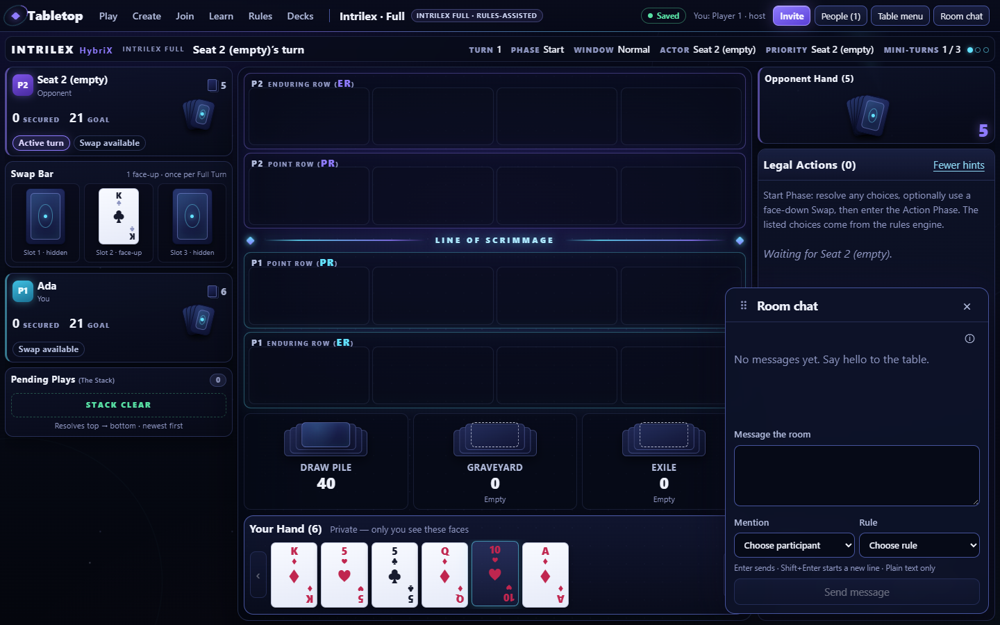
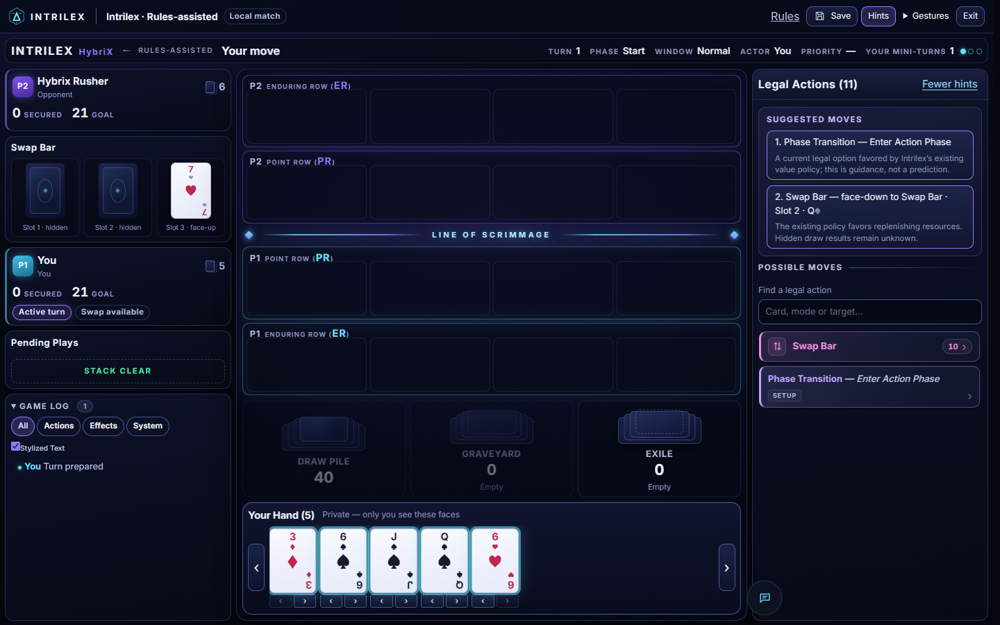
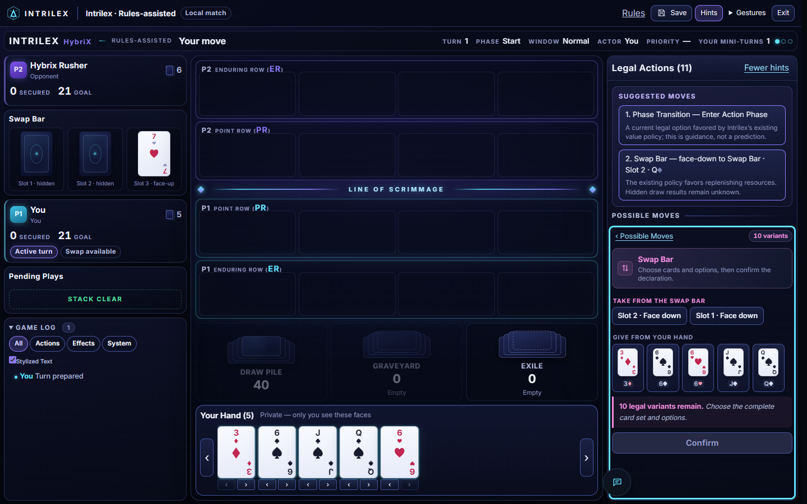

# Homecoming visual correction

September 30, 2026 (America/New_York).

The first delivery missed the requested near-same browserTabletop Full-profile interface. It brought over the rules-assist organization but kept illustrated Astra cards and substituted different panel, row and pile treatments. The corrected default Play board ports the donor's actual presentation.

## Live reference and corrected board

The reference is the donor's existing production build at source HEAD `782966336509dcc816888a3918ece2fd515a3725`, with the `intrilex-full` template selected through its actual Create flow. It ran on loopback with an isolated temporary SQLite database outside the donor repository. The reference browser reported no page errors and the donor working tree remained clean.

The destination screenshots use an actual canonical local Intrilex match (seed 12345), with the existing local session, policy and command vault. The engines, players, hands, available actions, and random deals differ. This comparison assesses presentation fidelity; it is not a pixel equality test or a rules-equivalence claim.

Donor Full-profile interface, 1440 × 900:

Corrected Intrilex default Play interface, 1440 × 900:

Corrected Action Composer:

## Presentation correspondence

| Donor feature | Corrected destination |
| --- | --- |
| Three columns at 23% / remaining / 24% | Same grid recipe, scoped to Homecoming. |
| Violet opponent seat, Swap Bar, cyan own seat, Pending Plays | Same order, colors, panel borders and badges; one compact hand count per seat. |
| Four row tracks with individual empty slots | Same slot geometry; expands when canonical public rows hold more cards. |
| Pale playing cards and blue patterned backs | Ported card markup and styling; validated Intrilex identities only. |
| Landscape Point Row tiles and glowing scrimmage divider | Same rank/suit tile treatment and divider recipe. |
| Three stacked landscape pile trays | Same tray treatment; contents limited to Intrilex's authorized projection. |
| Private hand tray with side arrows | Same compact cards and strip; Intrilex cosmetic reordering retained. |
| Banded Legal Actions header and inset suggestions | Same panel composition; Intrilex value-policy advice retained. |
| Possible Moves and parameter Composer | Original action-ID grouping and donor-style card options; direct moves play on click, editable compositions retain Confirm. |
| Game Log filter pills and Stylized Text control | Adapted to canonical public events and actor labels; occupies the lower-left rail. |
| Narrow action sheet with Hide/Show | Same fixed bottom-sheet arrangement; the rest of the page scrolls vertically. |

## Deliberate host adaptations

- The header uses Intrilex navigation and existing Save, Rules and Exit/Forfeit controls. The standalone tabletop's Create, Join, Decks and room ownership tools are separate product workflows.
- Remove the duplicated opponent-hand panel and summary fans. Legal Actions starts at the top of the right rail; Game Log fills the lower-left area beneath Pending Plays, with independent history and pending-play scrolling. Narrow history uses a bounded full-width block.
- Clicking a complete move or suggestion plays it directly. Single-choice Composers play on the final option; multi-part declarations and card sets keep Confirm. Submission resolves exactly one original current action ID through Intrilex's existing checks.
- The Mini-Turn display identifies **your** projected count. Opponent budget and Swap-use fields are unavailable in the current projection and are not invented.
- Graveyard exposes its authorized top card and count. Exile exposes its authorized count. Full pile browsing is not claimed because this view does not provide those contents.
- Chat uses Intrilex's existing match channel and input controls. Its dock does not reproduce the donor's participant/rule mention tools or draggable room-chat behavior.
- Classic/Caster and Guided Exhibition retain their specialized existing presentations.

Browser checks cover six desktop sizes (1024 × 576 through 2560 × 1440), 390/768px narrow layouts, card filtering and inspection, keyboard Composer focus, canonical actions, save/reload, Academy, two online seats, chat, reconnect, forfeit, replay and rematch. See [browser report](browser-report.json) and [validation record](validation.md) for actual results.
